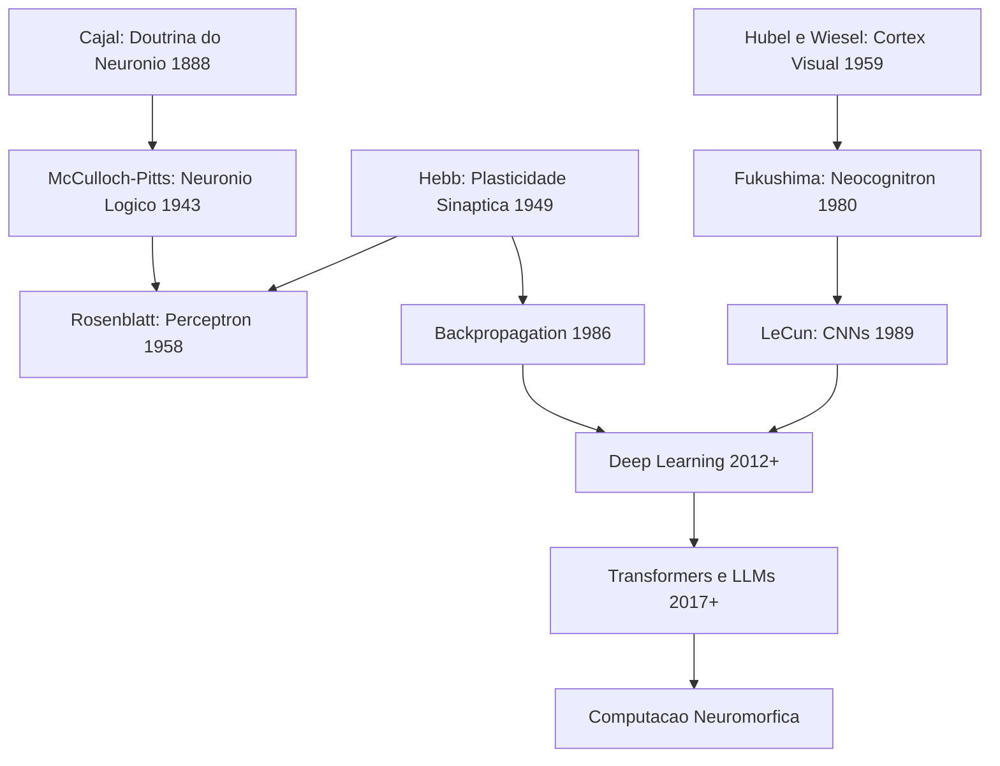

# 🧠 Fundamentos da Inteligência Artificial: Da Neurobiologia ao Deep Learning

> **Hub de Navegação** — Uma pesquisa aprofundada sobre as raízes, evolução e conexões interdisciplinares da IA

---

## 📚 Índice Geral — Capítulos Detalhados

Cada capítulo abaixo é um documento completo e aprofundado. Clique para acessar:

---

### Capítulo 1 — 🧬 [Raízes Neurobiológicas: O Neurônio Biológico](cap01_raizes_neurobiologicas.md)
A base de tudo: a Doutrina do Neurônio de Cajal, anatomia detalhada (dendritos, soma, axônio, sinapse), o potencial de ação e o mecanismo "tudo ou nada", plasticidade sináptica (Hebb, LTP, LTD), descobertas de Hubel & Wiesel sobre o córtex visual, tipos de neurônios e células gliais, e o cérebro em números.

---

### Capítulo 2 — 📜 [Era Pré-Perceptron: Das Raízes Filosóficas à Conferência de Dartmouth](cap02_era_pre_perceptron.md)
De Aristóteles a Turing: a lógica formal, Ramon Llull e a Ars Magna, Hobbes, Descartes, Leibniz e o sistema binário, Boole e a álgebra booleana, Babbage e Ada Lovelace, Torres y Quevedo, o neurônio de McCulloch-Pitts (1943) em profundidade, a cibernética de Wiener (1948), o Teste de Turing (1950), e a Conferência de Dartmouth (1956).

---

### Capítulo 3 — ⚡ [O Perceptron de Rosenblatt (1958)](cap03_perceptron_rosenblatt.md)
A história de Frank Rosenblatt, anatomia completa do perceptron (matemática + geometria), a regra de aprendizado detalhada, teorema de convergência, implementação Python funcional (com código para AND, OR e XOR), o Mark I Perceptron físico, ADALINE e Widrow-Hoff, MLP e o teorema da aproximação universal, e o legado de Rosenblatt.

---

### Capítulo 4 — ❄️ [O Inverno da IA (1969–1980s)](cap04_inverno_da_ia.md)
Minsky e Papert: biografias e motivações, o livro *Perceptrons* e a prova formal do XOR, a controvérsia (verdade técnica vs dano político), corte de financiamento e êxodo, a ascensão dos Sistemas Especialistas, os sobreviventes do inverno (Grossberg, Kohonen, Fukushima, Werbos), e lições históricas para o presente.

---

### Capítulo 5 — 🔥 [Renascimento: Backpropagation e Redes Multicamadas](cap05_renascimento_backpropagation.md)
Redes de Hopfield (1982) e a física no jogo, Máquinas de Boltzmann, o grupo PDP, backpropagation em profundidade (matemática completa + código Python que resolve o XOR), debate sobre bio-plausibilidade, Neocognitron e LeNet, LSTM, e o domínio temporário das SVMs.

---

### Capítulo 6 — 🚀 [A Revolução do Deep Learning](cap06_revolucao_deep_learning.md)
AlexNet e o ImageNet (2012), a escalada de profundidade (VGG, GoogLeNet, ResNet), GANs de Goodfellow, Transformers em profundidade (self-attention, multi-head, positional encoding), a família de LLMs (GPT-1 ao GPT-5), RLHF, capacidades emergentes, computação neuromórfica (SNNs, TrueNorth, Loihi), e o Human Brain Project.

---

### Capítulo 7 — 🔬 [Neurônio Biológico vs Artificial: Comparação Detalhada](cap07_comparativo_biologico_vs_artificial.md)
Comparação componente por componente (dendritos↔inputs, soma↔agregação, axon hillock↔ativação, sinapse↔peso), o que a IA não captura da biologia (neuromodulação, oscilações, glia, sono, emoção), e onde a IA supera o biológico.

---

### Capítulo 8 — 📅 [Linha do Tempo Cronológica Completa](cap08_linha_do_tempo.md)
Cronologia detalhada de ~350 a.C. até 2026: era filosófica, neurociência fundacional, IA clássica, o inverno, o renascimento, e a revolução do deep learning. Mais de 100 marcos históricos com protagonistas e significado.

---

### Capítulo 9 — 📖 [Glossário Completo de Conceitos](cap09_glossario_completo.md)
Definições detalhadas de A a Z: todos os termos de neurociência e IA usados nesta pesquisa, com contexto histórico e conexões interdisciplinares.

---

## 🔗 Documentos Complementares

Além dos capítulos acima, esta pesquisa inclui documentos sobre aspectos práticos:

| Documento | Conteúdo |
|---|---|
| [Como Criar e Treinar uma IA do Zero](pesquisa_criar_treinar_ia.md) | Pipeline completo de criação, código funcional, custos e diagnóstico de hardware |
| [Fine-Tuning de Modelos Abertos — Guia Completo](02_fine_tuning_modelos_abertos_guia_completo.md) | LoRA/QLoRA, código passo-a-passo, datasets, dicas avançadas |
| [Custos da IA vs Imóvel na Zona Leste de SP](03_custos_ia_vs_imovel_viabilidade.md) | Análise financeira detalhada, viabilidade no VivoBook 15, plataformas gratuitas |

---

## 🧭 Síntese: O Diálogo entre Cérebro e Máquina

A história da IA é inseparável da neurociência. Cada grande avanço foi inspirado por uma descoberta biológica:

> **Nota:** Embora a IA se inspire no cérebro, neurônios artificiais são simplificações extremas. O cérebro real usa codificação temporal, neurotransmissores diversos, modulação neuromodulatória, células gliais e mecanismos que ainda não compreendemos totalmente. A IA moderna funciona de forma muito diferente do cérebro — e isso não é necessariamente um problema.

---

> **Referências gerais:** McCulloch & Pitts (1943), Hebb (1949), Turing (1950), Rosenblatt (1958), Minsky & Papert (1969), Rumelhart, Hinton & Williams (1986), Vaswani et al. (2017), Kandel et al. "Principles of Neural Science" (2021).
